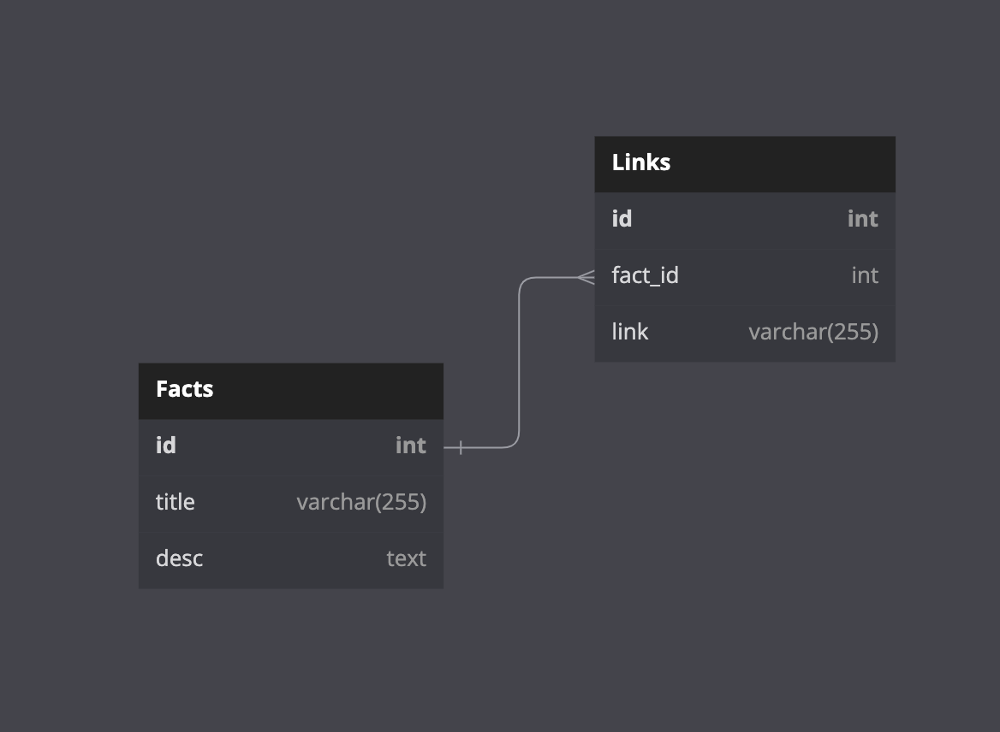

# Facts app
This is a very simple web server implemented on Golang 1.18 using 
standard library and database driver (PGX).

It can keep some random fact in its db, update it by request and
send back fact itself by an id.

## Requirements:
Docker/docker-compose.

## How to start:
```bash
$ make run
```
This command will create two containers:
* PostreSQL on 54320 port
* API itself on 8080 port


To stop API type:
```bash
$ make stop
```
or
```bash
$ docker-compose down
```
## Supported requests:
```
GET     /fact       :   Returns random fact from db
POST    /fact       :   Inserts a set of facts and returns them ids
GET     /fact/id    :   Returns fact with that id
PUT     /fact/id    :   Updates fact with that id
```
For more info [see OAI specification](openapi.yaml)

## Tests:
Made in another docker container with test version of database. To run tests locally:
```bash
$ make test
```
To see coverage report in your browser:
```bash
$ make report
```

## Db schema

I use PostgreSQL as a database in this project.


*Database schema illustration*


