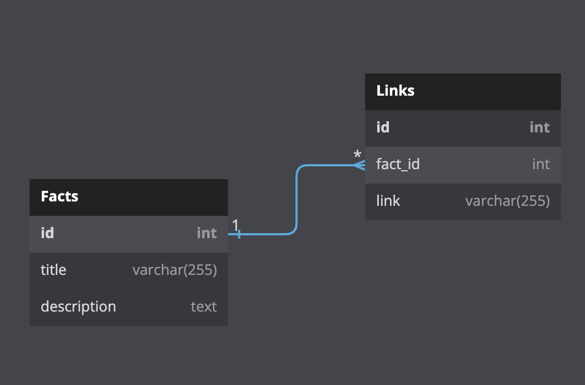

# Facts app
This is a very simple web server implemented on Golang 1.18.
It can keep some random fact in its db, update it by request and
send back fact itself by an id.

## Requirements:
Docker/docker-compose

## Deployment:
```bash
$ docker-compose up
```

## Db schema

*Database schema illustration*


